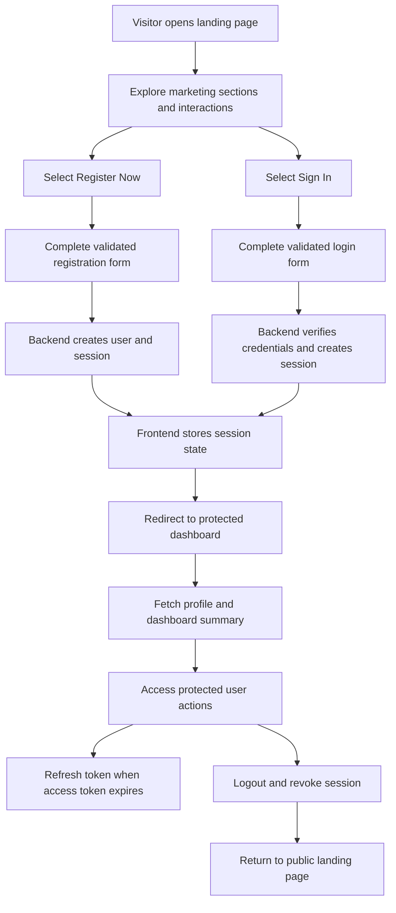

## 1. Product Overview
KUKUNET Digital is a desktop-first full-stack web platform that pairs a premium animated marketing landing page with a secure authentication flow and an authenticated user dashboard.
- It solves two connected needs: presenting KUKUNET's product/service value with the exact reference visual language, and converting visitors into authenticated users who can access a personalized dashboard.
- The product target is prospective customers and registered users who need a trustworthy, modern, finance-inspired web experience with strong visual polish and secure account management.

## 2. Core Features

### 2.1 User Roles
| Role | Registration Method | Core Permissions |
|------|---------------------|------------------|
| Visitor | Public website access | Browse landing page, pricing, FAQ, features, security content, open sign-in and register pages |
| Authenticated User | Email registration and login | Access protected dashboard, view profile summary, view account metrics, refresh session, log out |

### 2.2 Feature Module
1. **Landing page**: animated marketing sections, sticky feature stack, dashboard preview, pricing toggle, FAQ, testimonial carousel, mobile menu, smooth scrolling
2. **Register page**: validated account creation form, password strength guidance, confirm-password matching, graceful error states
3. **Login page**: validated sign-in form, authentication error handling, redirect into protected dashboard
4. **Dashboard page**: authenticated user header, key metrics, account status cards, quick actions, protected navigation, logout flow
5. **Session and auth backend**: JWT access/refresh flow, secure password hashing, profile endpoint, logout and token rotation

### 2.3 Page Details
| Page Name | Module Name | Feature description |
|-----------|-------------|---------------------|
| Landing page | Global navigation | Fixed nav with logo, section anchors, sign-in/register CTAs, desktop and mobile menu behaviors matching the reference interactions |
| Landing page | Ticker and trusted-by rails | Auto-generated marquee content with hover pause and infinite loop styling |
| Landing page | Hero section | KUKUNET-branded headline, editorial badge, CTA group, trust proof, animated dashboard card visual |
| Landing page | Stats section | IntersectionObserver-driven counters, trend indicators, animated progress bars |
| Landing page | Sticky features | Scroll-linked feature cards that switch an adjacent product mockup panel |
| Landing page | Dashboard preview | Period switcher for 7D/1M/3M/1Y with animated metric text and chart state |
| Landing page | Pricing | Monthly/annual toggle with dual-price display and plan emphasis |
| Landing page | Security | Trust badges and narrative content styled to match the premium dark system |
| Landing page | Testimonials | Auto-scrolling carousel with play/pause state control |
| Landing page | App section | Download CTAs and interactive phone tilt preview |
| Landing page | FAQ | Independent accordion items plus expand/collapse-all control |
| Register page | Registration form | Name, email, password, confirm password, validation feedback, submit loading state, auth success redirect |
| Login page | Login form | Email/password validation, backend error mapping, submit loading state, redirect after login |
| Dashboard page | Authenticated shell | User greeting, email/profile card, metrics summary, quick links, session-aware navigation |
| Dashboard page | Session controls | Protected API fetch for profile, refresh-aware authentication handling, logout button |

## 3. Core Process
Visitors land on the public homepage, explore the marketing sections, and choose either registration or login from the primary CTAs. Registration creates a secure user account and returns authenticated session tokens. Login validates credentials and starts a JWT-backed session. Authenticated users are redirected to the protected dashboard, where profile and summary metrics load from protected backend endpoints. Expired access tokens are refreshed transparently using the refresh session flow. Logout revokes the current session and returns the user to the public experience.

## 4. User Interface Design
### 4.1 Design Style
- Primary colors: deep slate surfaces with layered dark panels and sky-blue accents derived from the design prompt
- Secondary colors: cream-tinted text ladder, restrained green/red status colors, muted border blues
- Button style: premium rounded controls with subtle glow, soft elevation, micro-translation, and strong CTA contrast
- Fonts: `Outfit` for display/numeric emphasis and `DM Sans` for body/UI, matching the supplied reference
- Layout style: desktop-first editorial landing composition with asymmetric hero, sticky feature stack, dashboard cards, and section rhythm across a dark canvas
- Icon style suggestions: thin-stroke financial/product icons, geometric badges, low-noise gradients, restrained glow effects, and logo-first branding

### 4.2 Page Design Overview
| Page Name | Module Name | UI Elements |
|-----------|-------------|-------------|
| Landing page | Theme system | Tailwind tokens or theme variables that preserve the prompt palette, section spacing, borders, and shadow language |
| Landing page | Motion system | Silk easing, staggered reveals, hover lift, scroll-triggered activation, marquee animation, and phone tilt behavior |
| Landing page | Hero | Large Outfit headline, badge, CTA pair, trust avatars, floating metric badges, dashboard mockup |
| Landing page | Features and dashboard | Sticky cards, swappable panel views, miniature charts, status chips, compact list rows |
| Landing page | Pricing and FAQ | Toggle switch, featured plan emphasis, structured accordion items, subtle hover feedback |
| Auth pages | Form shell | Dark-card layout, consistent brand typography, inline validation, strong primary action, low-friction navigation back to landing |
| Dashboard page | Authenticated workspace | Personalized header, KPI cards, account health indicators, recent activity, protected actions, responsive side or top navigation |

### 4.3 Responsiveness
The experience is desktop-first with polished tablet and mobile adaptation. Navigation collapses into a mobile menu, stacked sections become single-column below the design breakpoint, dashboard cards reflow vertically, and all auth forms remain thumb-friendly with clear spacing and accessible focus states.

### 4.4 3D Scene Guidance
- The phone preview uses pseudo-3D tilt rather than a full 3D engine, preserving the exact reference interaction with requestAnimationFrame easing
- Perspective should be applied through CSS transforms with a stable frame, smooth reset, and motion reduction fallback
- The visual focus stays on the device mockup and dashboard cards, not on decorative effects that distract from the KUKUNET brand content

## 5. Assumptions And Constraints
- The CSS file referenced by `index.html` is not currently present in the workspace, so the final implementation should reconstruct the visual system from the provided HTML structure, interaction script, and prompt document unless the missing stylesheet is later supplied.
- The frontend must preserve the supplied section order, typography choices, animation intent, and interactive behaviors while translating the implementation into Next.js plus Tailwind CSS.
- Authentication is email/password based only in the initial release, with secure JWT access and refresh token handling backed by PostgreSQL and Drizzle ORM.
