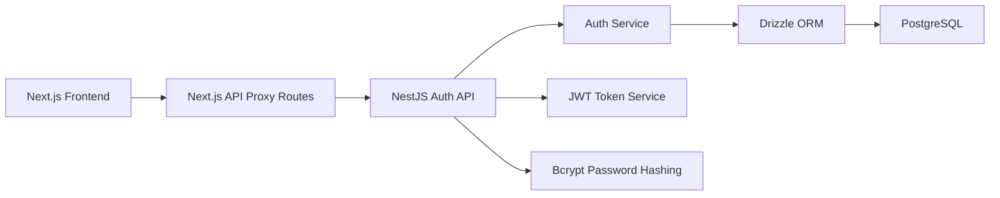
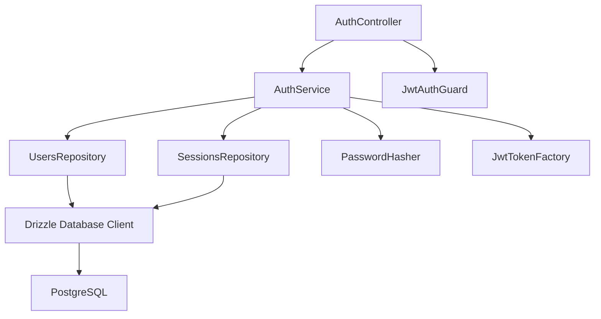
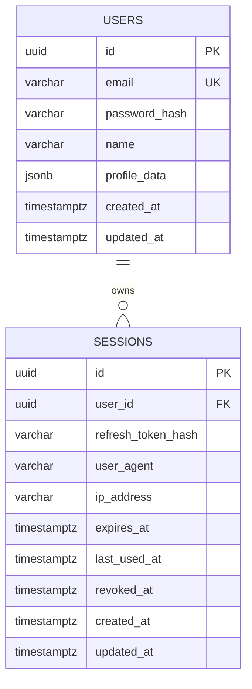

## 1. Architecture Design


## 2. Technology Description
- Frontend: Next.js App Router with React and TypeScript, Tailwind CSS, server/client components as appropriate, cookie-based auth-aware UI state
- Backend: NestJS with TypeScript, modular auth architecture, JWT access and refresh strategy, class-validator DTO validation
- Database: PostgreSQL with Drizzle ORM, SQL migrations, indexed user and session tables
- Shared concerns: Zod or typed DTO-safe request/response models, strict TypeScript config, no `any` usage, environment-driven configuration
- Assets and branding: local KUKUNET logo asset embedded into frontend, Google Fonts integration for `Outfit` and `DM Sans`

## 3. Route Definitions
| Route | Purpose |
|-------|---------|
| `/` | Public marketing landing page replicating the supplied design and interactions |
| `/login` | Sign-in page with validation and backend auth integration |
| `/register` | Registration page with password rules and confirmation matching |
| `/dashboard` | Protected authenticated user dashboard |
| `/api/auth/login` | Frontend API route that forwards login requests to NestJS |
| `/api/auth/register` | Frontend API route that forwards registration requests to NestJS |
| `/api/auth/logout` | Frontend API route that forwards logout requests and clears client cookies |
| `/api/auth/profile` | Frontend API route that requests current profile from NestJS |
| `/api/auth/refresh` | Frontend API route that refreshes access using refresh session token |

## 4. API Definitions
### 4.1 TypeScript DTO Shapes
```ts
export interface RegisterRequest {
  name: string;
  email: string;
  password: string;
  confirmPassword: string;
}

export interface LoginRequest {
  email: string;
  password: string;
}

export interface AuthTokens {
  accessToken: string;
  refreshToken: string;
  accessTokenExpiresAt: string;
  refreshTokenExpiresAt: string;
}

export interface AuthUser {
  id: string;
  name: string;
  email: string;
  createdAt: string;
  updatedAt: string;
}

export interface AuthResponse {
  user: AuthUser;
  tokens: AuthTokens;
}

export interface ProfileResponse {
  user: AuthUser;
}

export interface LogoutResponse {
  success: true;
}
```

### 4.2 Endpoint Specifications
| Method | Endpoint | Purpose | Auth Required |
|--------|----------|---------|---------------|
| `POST` | `/auth/register` | Create a new user, hash password, create refresh session, return auth payload | No |
| `POST` | `/auth/login` | Verify credentials, rotate/create refresh session, return auth payload | No |
| `POST` | `/auth/refresh` | Validate refresh token, rotate session, issue new access and refresh tokens | Refresh token |
| `GET` | `/auth/profile` | Return authenticated user profile | Access token |
| `POST` | `/auth/logout` | Revoke the current refresh session and clear frontend auth state | Refresh token or authenticated session context |

### 4.3 Example Request/Response Contracts
```ts
// POST /auth/register
type RegisterBody = RegisterRequest;
type RegisterResult = AuthResponse;

// POST /auth/login
type LoginBody = LoginRequest;
type LoginResult = AuthResponse;

// POST /auth/refresh
interface RefreshRequest {
  refreshToken: string;
}
type RefreshResult = AuthResponse;

// GET /auth/profile
type ProfileResult = ProfileResponse;

// POST /auth/logout
interface LogoutRequest {
  refreshToken: string;
}
type LogoutResult = LogoutResponse;
```

## 5. Server Architecture Diagram


## 6. Data Model
### 6.1 Data Model Definition


### 6.2 Data Definition Language
```sql
CREATE TABLE users (
  id UUID PRIMARY KEY,
  email VARCHAR(255) NOT NULL UNIQUE,
  password_hash VARCHAR(255) NOT NULL,
  name VARCHAR(120) NOT NULL,
  profile_data JSONB NOT NULL DEFAULT '{}'::jsonb,
  created_at TIMESTAMPTZ NOT NULL DEFAULT NOW(),
  updated_at TIMESTAMPTZ NOT NULL DEFAULT NOW()
);

CREATE INDEX users_email_idx ON users (email);

CREATE TABLE sessions (
  id UUID PRIMARY KEY,
  user_id UUID NOT NULL REFERENCES users(id) ON DELETE CASCADE,
  refresh_token_hash VARCHAR(255) NOT NULL,
  user_agent VARCHAR(255),
  ip_address VARCHAR(64),
  expires_at TIMESTAMPTZ NOT NULL,
  last_used_at TIMESTAMPTZ NOT NULL DEFAULT NOW(),
  revoked_at TIMESTAMPTZ,
  created_at TIMESTAMPTZ NOT NULL DEFAULT NOW(),
  updated_at TIMESTAMPTZ NOT NULL DEFAULT NOW()
);

CREATE INDEX sessions_user_id_idx ON sessions (user_id);
CREATE INDEX sessions_expires_at_idx ON sessions (expires_at);
CREATE UNIQUE INDEX sessions_refresh_token_hash_idx ON sessions (refresh_token_hash);
```

## 7. Implementation Structure
- Monorepo layout: `apps/web` for Next.js, `apps/api` for NestJS, `packages/config` only if shared config becomes necessary
- Frontend composition: app routes, reusable UI sections, auth form components, motion hooks, typed API client, route protection helper, token refresh helper
- Backend composition: `auth`, `users`, `database`, and `health` modules, with DTOs, guards, strategies, repositories, and config services
- Styling approach: Tailwind utilities plus a small theme layer in `globals.css` for color tokens, animation keyframes, marquee motion, and pseudo-element effects that are impractical as raw utilities alone

## 8. Security And Runtime Decisions
- Passwords are hashed with bcrypt before persistence and never returned in responses
- Refresh tokens are stored hashed in the `sessions` table so database leakage does not expose live tokens
- Access tokens are short-lived; refresh tokens are rotated on login and refresh
- Protected backend routes use JWT guards; protected frontend routes verify server session state before rendering sensitive content
- Authentication errors return user-safe messages while backend logs keep more detailed failure context

## 9. Delivery Notes
- The implementation must add `.env.example` files for both apps and document local setup, migrations, and run commands
- Because the source stylesheet is missing from the workspace, the Tailwind implementation will use the supplied HTML, JavaScript behavior, and design prompt as the reference baseline unless the missing CSS file is provided later
